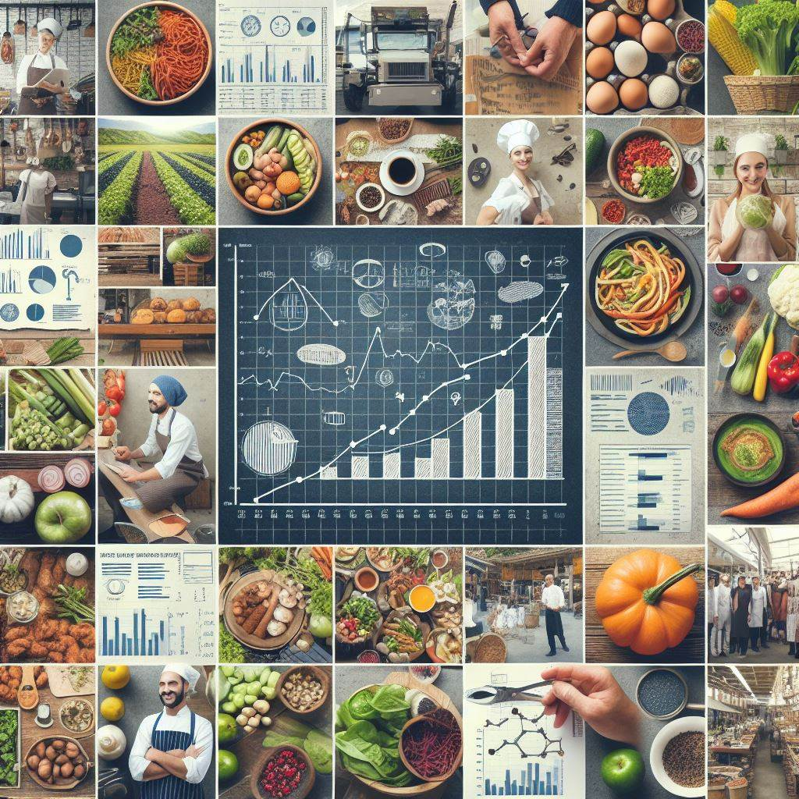

# Food Market Analysis

## Overview

This Project aims to help a new restaurant owner wants to open a successful venture in the city but want to get a fair idea about the factors affecting the establishment of different types of resturants as he is unsure about the ideal location, cuisine type, and pricing strategy also aims to predict restaurant ratings based on various features such as location, menu variety, cuisine types, and customer reviews. 

## Table of Contents

- [Data](#data)
- [Data Preperation](#data-Preperation)
- [Exploratory Data Analysis (EDA)](#eda)
- [Feature Engineering](#feature-engineering)
- [Modeling](#modeling)
- [Evaluation](#evaluation)
- [Conclusion](#conclusion)
- [Future Work](#future-work)
- [Contributing](#contributing)
- [License](#license)

## Data

The dataset used for this project contains information about restaurants, including their location, menu items, cuisines, ratings, and customer reviews. The data is sourced from  [Himanshu Poddar | Contributor | Kaggle](https://www.kaggle.com/himanshupoddar/datasets).

## Data Preparation

Data preparation involves cleaning, preprocessing, and transforming the raw data into a format suitable for analysis and modeling. This includes data profiling, handling missing values, removing outliers, and converting categorical variables into numerical representations. 

## Exploratory Data Analysis (EDA)

During the EDA phase, various statistical and visualization techniques were employed to gain insights into the data. This included analyzing the distribution of ratings, exploring correlations between different features, and identifying patterns in the data.

## Feature Engineering

Feature engineering involved creating new features, handling missing values, and preprocessing the data to prepare it for modeling. Techniques such as scaling, encoding categorical variables, and creating interaction terms were applied to enhance the predictive power of the models.

## Modeling

Several machine learning algorithms were explored for predicting restaurant ratings, including linear regression, random forest regression, and principal component analysis (PCA). Models were trained, evaluated, and optimized using techniques such as cross-validation and hyperparameter tuning.

## Evaluation

Model performance was evaluated using metrics such as R-squared, mean squared error (MSE), and cross-validation scores. The models were assessed based on their ability to generalize to unseen data and their interpretability.

## Conclusion

The project concludes with insights into the predictive power of the developed models and their limitations. Future directions for improving model performance and exploring additional areas for research are also discussed.

## Future Work

**Market Research and Understanding:**

* **Identify popular cuisines and restaurant types:** Analyze the distribution of cuisines and restaurant types to understand what Bangalorean diners prefer.
* **Explore neighborhood trends:** Examine which cuisines and types are prevalent in different areas, uncovering unique culinary identities.
* **Benchmark pricing strategies:** Analyze average costs per person for different cuisines and locations to inform your own pricing decisions.
* **Investigate online ordering and delivery trends:** Analyze the prevalence of online ordering and delivery options to understand customer preferences and potential delivery service gaps.

**Customer Insights and Recommendations:**

* **Build restaurant recommendation systems:** Recommend restaurants to users based on their preferences, location, budget, and cuisine choices.
* **Predict restaurant ratings:** Develop models to predict how users might rate a restaurant based on various factors.
* **Analyze user reviews:**  Perform sentiment analysis to understand customer satisfaction and identify areas for improvement for restaurants.
* **Identify hidden gems:** Uncover popular but under-the-radar restaurants based on factors like high ratings but fewer reviews.

**Business-Specific Applications:**

* **Target advertising and marketing campaigns:** Identify relevant customer segments for specific restaurants based on their cuisine, location, and online behavior.
* **Identify optimal locations for new restaurants:** Analyze existing successful restaurants and demographic data to predict promising locations for new ventures.
* **Competitor analysis:** Compare your restaurant's performance to competitors based on ratings, reviews, and online presence.

**Machine Learning Applications:**

* **Clustering restaurants:** Cluster restaurants based on various factors like cuisine, price range, location, and rating to identify distinct market segments.
* **Building chatbots:** Train chatbots to answer customer queries about restaurants based on the dataset information.

## Contributing

Contributions to this project are welcome! Feel free to fork the repository, make changes, and submit a pull request with your enhancements or bug fixes.

